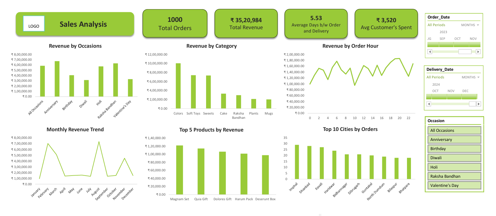

# Sales Analysis Dashboard (Excel)

An interactive Excel dashboard designed to analyze sales performance, revenue trends, and customer behavior using pivot tables, charts, and slicers.

---

## Overview  

This dashboard provides insights into sales data, helping track key metrics such as total revenue, total orders, average delivery time, and customer spending. It enables quick analysis of sales trends across occasions, categories, products, and cities.

---

## Key Highlights  

- Analyzed total orders and revenue performance  
- Visualized revenue by occasions and product categories  
- Identified top-performing products and cities  
- Tracked monthly revenue trends and order patterns  
- Analyzed customer spending behavior  
- Included interactive filters for date, delivery period, and occasions  

---

## Tools Used  

- Microsoft Excel  
- Pivot Tables  
- Charts  
- Slicers  

---

## Dashboard Preview  

---

## Project Files  

- [Download Excel Dashboard](./sales-analysis-dashboard.xlsx)  
  Contains dashboard, raw data, and pivot-based analysis  

> Note: Please download the Excel file and open it in Microsoft Excel to view the interactive dashboard.

---

## Insights  

- Certain occasions (like Anniversary and Raksha Bandhan) generate higher revenue  
- Colors and Soft Toys are top-performing categories  
- A few products contribute significantly to total revenue  
- Sales show fluctuations across months, indicating seasonal demand  
- Top cities contribute a major share of total orders  

---
